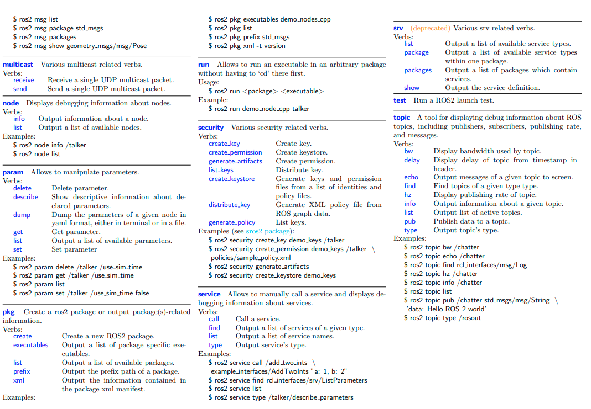

# ROS2_Planification_and_Cognitive_Systems

Repository for planification and cognitive systems course at URJC

This repo is maintained by:

- Alejandro Sanchez Alvarez
- Pablo Castellanos Lopez
- Mario Esteban Fernández

Projects:

1. Scan Fake: A fake scan to test ROS2 and rviz2: [Scan Fake](https://github.com/P4B5/ROS2_Planification_and_Cognitive_Systems/tree/main/scan_fake)

2. Planning: An extensively explanation about TFD, MetricFF and POPF planners: [Planners](https://github.com/P4B5/ROS2_Planification_and_Cognitive_Systems/tree/main/planning)

3. Plansys2 Optic Plugin: An optic plugin for plansys2:  [Planys2 Optic Plugin](https://github.com/P4B5/plansys2_optic_plugin)

4. Apartment navigation: A complete robot pick&place task integrating plansys2 and nav2 inside an apartment: [Apartment navigation](https://github.com/P4B5/ROS2_Planification_and_Cognitive_Systems/tree/main/apartment_actions)

