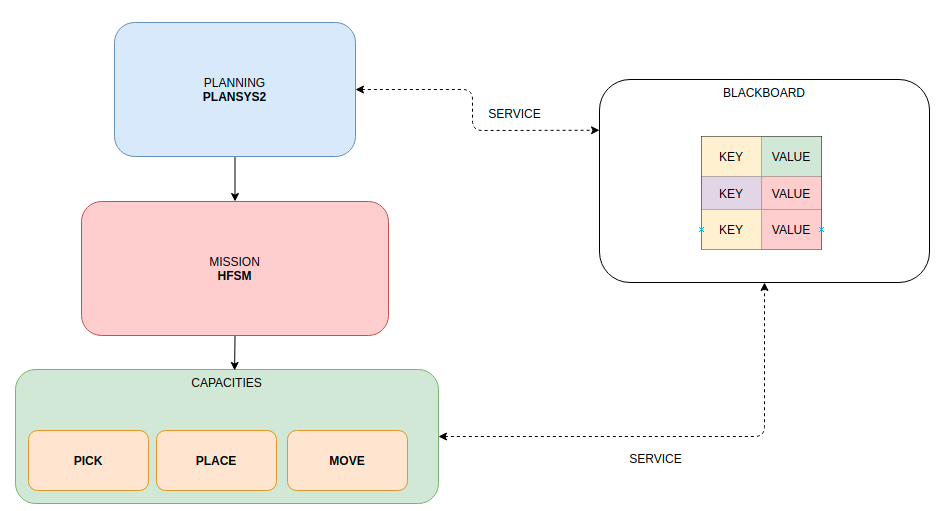
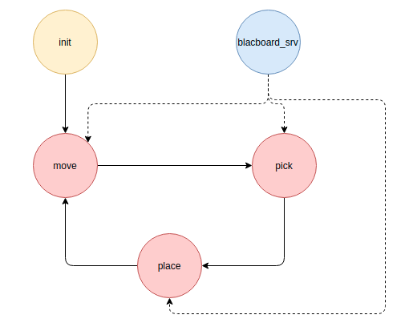

# Apartment, cognitive implementation

This implementation of the apartment exercise, it has been implemented using cognitive behavior which provides a better response for robots executing complex tasks. 

## Manual execution

1. BlackBoard: 
2. Planning:
3. state machine: `ros2 run cognitive_apartment hfsm_cognitive_apartment`

## Schema of the general implementation

## Schema of the state machine

